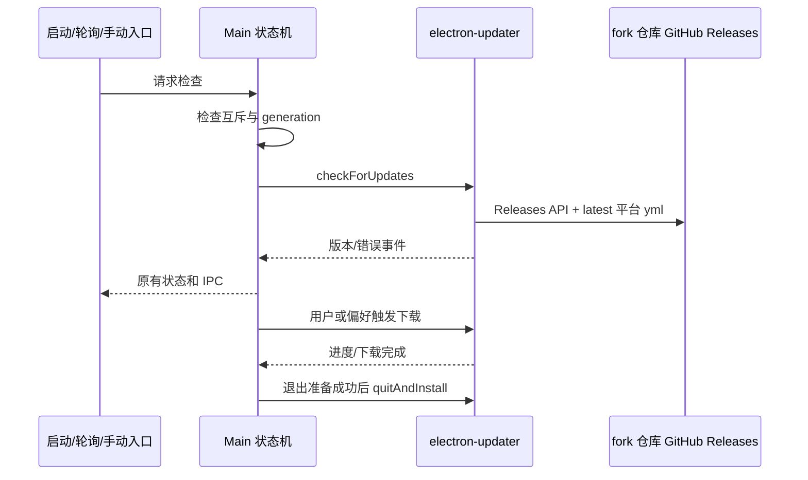

# ZCodium 桌面更新

## 规则与边界

- Main `autoUpdater.ts` 是更新状态、检查互斥、下载取消和安装调度的唯一所有者；UI 和 IPC 载荷不变。
- 更新源仓库坐标（owner/repo）只有单一所有者：`packages/desktop/scripts/update-feed-target.mjs` 的 `resolveUpdateFeedTarget`，默认指向本 fork 发布仓库 `jonntd/ZCodium`，可用 `ZCODE_UPDATE_GITHUB_OWNER` / `ZCODE_UPDATE_GITHUB_REPO` 覆盖。三个消费方必须同源：tsup `define` 注入 `__ZCODE_UPDATE_GITHUB_OWNER__` / `__ZCODE_UPDATE_GITHUB_REPO__` 供运行时读取；electron-builder `publish` 配置生成 app-update.yml 与 latest*.yml。业务源码中不得再出现硬编码 owner/repo。
- 运行时使用 electron-updater 内置 GitHub provider（Releases API），并 `allowPrerelease = true`：发布版本包含 GitHub Pre-release，generic 的 `/releases/latest` 会 404。electron-builder 侧保持 `--publish never`，发布一律由 CI 的 `gh release upload` 完成。
- generic provider 仅用于显式覆盖：启动参数 `--zcode-update-feed-url` 优先于 `ZCODE_UPDATE_FEED_URL`，开发及打包环境均可覆盖为 generic feed 根目录；不接受旧官方 manifest API 语义。
- 更新元数据由 electron-updater 读取 latest.yml、latest-mac.yml、latest-linux.yml（非 x64 Linux 使用架构后缀 latest-linux-arm64.yml；mac 无架构后缀文件，MacUpdater 按文件 URL 是否含 `arm64` 过滤）。macOS 自动更新需要发布 ZIP 等原生 updater 所需资源，不能只有 DMG。元数据中的文件路径、校和与下载安装由 updater 处理。
- fork 发布流水线（`release-fork.yml`）必须上传 electron-updater 所需元数据：各平台 latest*.yml 与 `*.blockmap`（差分下载）。两个 mac 架构 job 各自产出只含本架构条目的 latest-mac.yml，必须先重命名为 `latest-mac-arm64.yml` / `latest-mac-x64.yml` 上传，再由合并脚本（`packages/desktop/scripts/merge-mac-update-yml.mjs`）在发布前合并为同时含双架构 zip 条目的 latest-mac.yml；直接 `--clobber` 互相覆盖会让其中一个架构更新失败或被装上错误架构。
- 默认只发布 latest 稳定通道，preview 偏好不会切换接口或请求 preview.yml；版本跳过归属 stable。保留现有 preview 产品禁用更新的边界。
- 保留启动检查、每小时轮询、手动入口、原生下载与安装流程。`maybeBlockStartupForForceUpdate` 保留签名及调用点，直接返回 `{ blocked: false }`；`requestForceAutoUpdate` 保留签名及 disposer，为无副作用 no-op。
- 元数据缺失、网络失败及校验错误沿用现有错误状态，不回退任何外部服务。

## 事件顺序

不新增持久化所有者，不改 Host/mobile stream 协议。检查 generation、取消 token 和安装互斥沿用现有状态机。

## 验收

- 执行真实更新模块的边界替身测试：默认 GitHub provider 使用构建注入坐标、custom feed 覆盖保持 generic、启动/手动检查、更新事件及下载/安装 IPC 保持可用。
- 执行合并脚本测试：双架构 latest-mac.yml 合并后同时含两架构条目、版本不一致时报错、单架构输入原样透传。
- 执行内置 GenericProvider，验证各平台 yml 请求和相对安装包 URL 解析。
- 守卫在注入会抛错的网络/阻塞回调时仍返回不阻塞；强制更新入口无网络、无状态回调。
- `pnpm typecheck`、`pnpm lint`、架构检查通过；真实签名安装包升级需发布后另行验证。
